# PROJECT Design Documentation

> _The following template provides the headings for your Design
> Documentation.  As you edit each section make sure you remove these
> commentary 'blockquotes'; the lines that start with a > character
> and appear in the generated PDF in italics but do so only **after** all team members agree that the requirements for that section and current Sprint have been met. **Do not** delete future Sprint expectations._

## Team Information
* Team name: Albatross
* Team members
  * Joseph Pilon
  * Matthew Peck
  * Andy Lin
  * Naif Alanazi

## Executive Summary

This project is considered to be a website that allows users to sign in and donate needs.
It allows for a manager to sign in as well in order to update the cupboard of needs that the
customers will be able to see.

### Purpose

To create a Web-Based Ufund system, where users are able to select from a Cupboard of "Needs" to provide to a Specific Charity. Users are able to add/remove "Needs" from their unique Funding Basket, and choose to checkout their basket, locking in their "Purchase".

### Glossary and Acronyms
> _**[Sprint 2 & 4]** Provide a table of terms and acronyms._

| Term | Definition |
|------|------------|
| SPA  | Single Page|
| MVP  | Minimum Viable Product|
| REST | Representational State Transfer|
| MVVM | Model-View-ViewModel|
| UI   | User Interface|
| API  | Application Programming Interface|
| DAO  | Data Access Object|

## Requirements

This section describes the features of the application.

> _In this section you do not need to be exhaustive and list every
> story.  Focus on top-level features from the Vision document and
> maybe Epics and critical Stories._

### Definition of MVP

Charity donation website, where users are able to login and view their unique Funding Basket and the currently needed "Needs" from the Cupboard. Users are able to checkout the Needs in their basket and thus removes those Needs from the Cupboard.

### MVP Features
>  _**[Sprint 4]** Provide a list of top-level Epics and/or Stories of the MVP._

"As a Helper I want to see a list of needs so that I choose what to contribute to."

"As a Helper, I want to store the needs that I want to contribute to in one place so that I can keep track of what needs I plan to contribute to."

"As a Helper, I want to be able to come back to the needs that I plan to contribute to, at another time, so that I'm not rushed with my decision." 

"As a Helper, I want to be able to “checkout” the needs that I plan to contribute to, so that I can fund them."

"As a User, I want to be able to "login" as an Admin, so that I can manage the website."

"As a User, I want to be able to "login" as a Helper, so that I can donate to the charity"

"As a U-fund Manager, I don't want to see the funding baskets of users so that their privacy is respected."

### Enhancements
> _**[Sprint 4]** Describe what enhancements you have implemented for the project._

"As a Helper, I want to be able to contact Managers so that I can receive help on any issues I have."

"As a U-fund Manager I want to be able to respond to help requests sent by users so that I can answer/help user inquires."

"As a User, I WANT to be able to view donation statistics so that I know how much I've donated so far."

Our enhancements involve a Request System, which allows users to make requests to the Admins about certain things they may want, and Admins are able to view and resolve those requests made by users.

## Application Domain

This section describes the application domain.

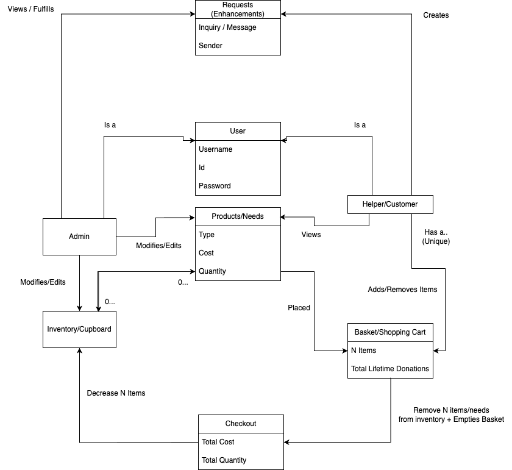

There are 2 types of Users: Admin and Helper. 

Both types of users are able to view Needs and the "Dashboard", while the Admin is able to edit/modify the Needs in the Inventory/Cupboard.

Both types of users has access to the Request Service, where Helpers are able to send out requests to the Admins and the Admins are able to view all requests and mark them as fulfilled.

Each helper has a Funding Basket, where they can Add/Remove Needs (from the Cupboard). From the Funding Basket, a Helper can "Checkout", which empties the Funding Basket and decreases the quantity of those needs in the Cupboard.

## Architecture and Design

This section describes the application architecture.

### Summary

The following Tiers/Layers model shows a high-level view of the webapp's architecture. 
**NOTE**: detailed diagrams are required in later sections of this document.
> _**[Sprint 1]** (Augment this diagram with your **own** rendition and representations of sample system classes, placing them into the appropriate M/V/VM (orange rectangle) tier section. Focus on what is currently required to support **Sprint 1 - Demo requirements**. Make sure to describe your design choices in the corresponding _**Tier Section**_ and also in the _**OO Design Principles**_ section below.)_

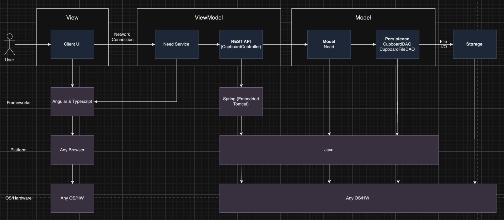
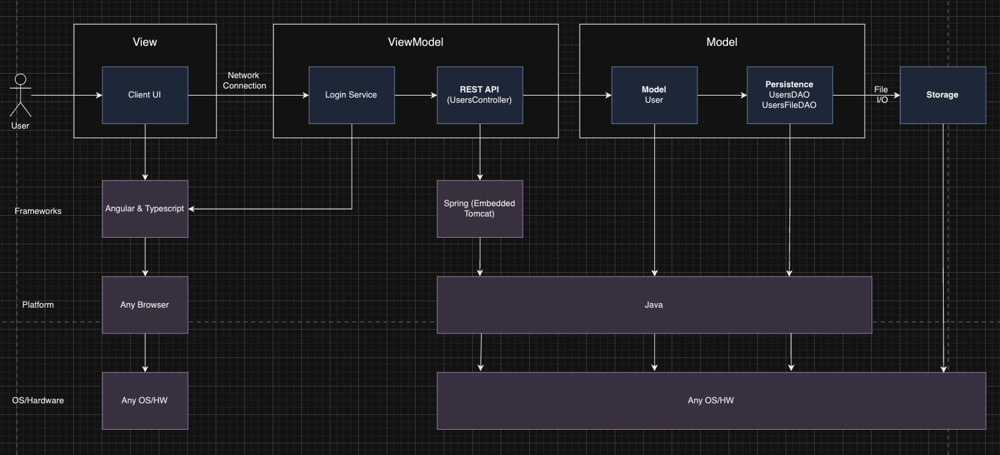
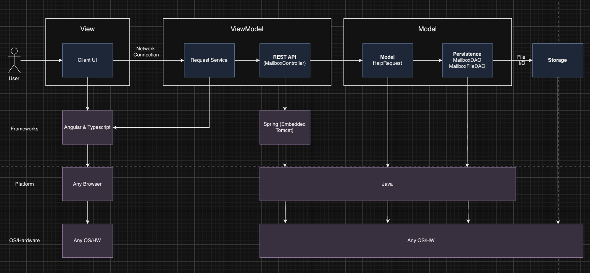

The web application, is built using the Model–View–ViewModel (MVVM) architecture pattern. 

The Model stores the application data objects including any functionality to provide persistance. 

The View is the client-side SPA built with Angular utilizing HTML, CSS and TypeScript. The ViewModel provides RESTful APIs to the client (View) as well as any logic required to manipulate the data objects from the Model.

Both the ViewModel and Model are built using Java and Spring Framework. Details of the components within these tiers are supplied below.

### Overview of User Interface

This section describes the web interface flow; this is how the user views and interacts with the web application.

### View Tier
> _**[Sprint 4]** Provide a summary of the View Tier UI of your architecture.
> Describe the types of components in the tier and describe their
> responsibilities.  This should be a narrative description, i.e. it has
> a flow or "story line" that the reader can follow._

> _**[Sprint 4]** You must  provide at least **2 sequence diagrams** as is relevant to a particular aspects 
> of the design that you are describing.  (**For example**, in a shopping experience application you might create a 
> sequence diagram of a customer searching for an item and adding to their cart.)
> As these can span multiple tiers, be sure to include an relevant HTTP requests from the client-side to the server-side 
> to help illustrate the end-to-end flow._

> _**[Sprint 4]** To adequately show your system, you will need to present the **class diagrams** where relevant in your design. Some additional tips:_
 >* _Class diagrams only apply to the **ViewModel** and **Model** Tier_
>* _A single class diagram of the entire system will not be effective. You may start with one, but will be need to break it down into smaller sections to account for requirements of each of the Tier static models below._
 >* _Correct labeling of relationships with proper notation for the relationship type, multiplicities, and navigation information will be important._
 >* _Include other details such as attributes and method signatures that you think are needed to support the level of detail in your discussion._

Users start at the Login Page, where they are presented two textboxes to take an entered username + password, as well as a Login button. Once Login is pressed, depending on if the user is an Admin or regular User, they are presented with either the Admin page or the Cupboard page.

From the Admin page, the user can add, delete, or update needs to/from the Cupboard. From the Cupboard page, a regular user is able to view details of each Need and have the ability to click into a specific Need's details, and there they are able to add the Need to their funding basket. An Admin is also able to edit/delete needs from the Cupboard page.

From the Cupboard page, the user is able to view all the needs currently in the Cupboard as well as their details. As a Helper, they are also able to add those needs into their respective funding basket, once clicking the Need. As an Admin, they are able to remove needs from the Cupboard, as well as edit their details once clicking on the Need.

As a Helper, they are able to view their funding basket by clicking the Funding Basket button from the navbar on top of the page, where they are moved to the Funding Basket page. From the Funding Basket page the User is able to remove needs and checkout the needs in their basket, adding the total amount of money spent to their total donations, which is also shown on the page.

As either a Helper or Admin, the Requests button in the navbar will take the user to their respective Requests page, where if the user is an Admin, they are able to see incoming requests made by regular users, and if the user is a regular user, they able to create requests for Admins to view.

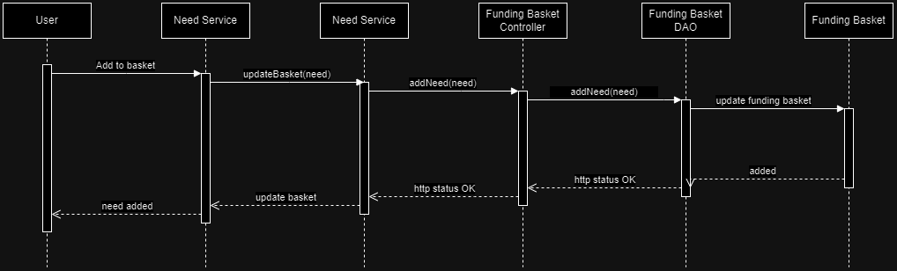
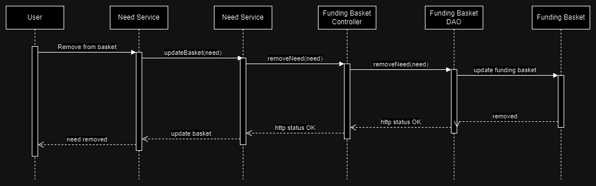

### ViewModel Tier 
    
    CupboardController.java is used to read in the commands and calls the commands to make adjusments to the cupboard or specific instructions from the user.

    need.service.ts is calling the cupboardController commands in order to access the backend side of the data and view it in order to display/access the needs in the cupboard on the front side.

    MailboxController.java is used to read in commands and 
    calls commands to make certain adjusments to handling 
    the requests that the users have sent to the admin.

    request.service.ts is calling the methods contained in the mailboxController which is able to post/delete help requests sent from users in the backend from the front end. 

    UsersController.java is used to read in commands
    and calls that handle all the users as well as accessing
    each user's specific basket. 

    login.service.ts is calling the methods contained in the usersController class that handles not adding/deleting/manipulating users, but also handles the total of the specific user's basket as well as adding/removing items from the user basket. 

    

> _**[Sprint 4]** Provide a summary of this tier of your architecture. This
> section will follow the same instructions that are given for the View
> Tier above._

> _At appropriate places as part of this narrative provide **one** or more updated and **properly labeled**
> static models (UML class diagrams) with some details such as critical attributes and methods._
> 

### Model Tier

    HelpRequests.java is used to model the object that is a HelpRequest and its attributes, keeping track of it's sender/creator as well as its message.

    MailboxDAO.java is used to define specific functions such as getting a specific request, posting a new request, or deleting a request. 

    MailboxFileDAO.java's methods are called by MailboxDAO with the functions that have been defined and this is where each function defined in the MailboxDAO is actually affecting the data/backend.

    Need.java is used to model the object that is a Need and its attributes that will be shown in the cupboard.

    CupboardDAO.java is used to define specific functions such as getting the needs, creating needs, or deleting needs.

    CupboardFileDAO.java's methods are called by CupboardDAO.java and contains all the functions that were previously defined but this is where the data is manipulated and stored in the backend. 
    
    User.java is used to model the object that is a User and its attributes.

    UsersDAO.java is used to define specific functions such as getting users, posting new users, and deleting users.

    UsersFileDAO.java's methods are called from UsersDAO.java and this is where all of the previously defined functions reside which are able to manipulate the data in the backend. 

    CupboardDAO.java defines different functions that the cupboard is able to use and perform while manipulating different needs.
    CupboardFileDAO.java is used to define each of the functions that cupboardDAO uses and actually writes the functions actions that they will be performing.
    
> _**[Sprint 2, 3 & 4]** Provide a summary of this tier of your architecture. This
> section will follow the same instructions that are given for the View
> Tier above._

> _At appropriate places as part of this narrative provide **one** or more updated and **properly labeled**
> static models (UML class diagrams) with some details such as critical attributes and methods._
> 
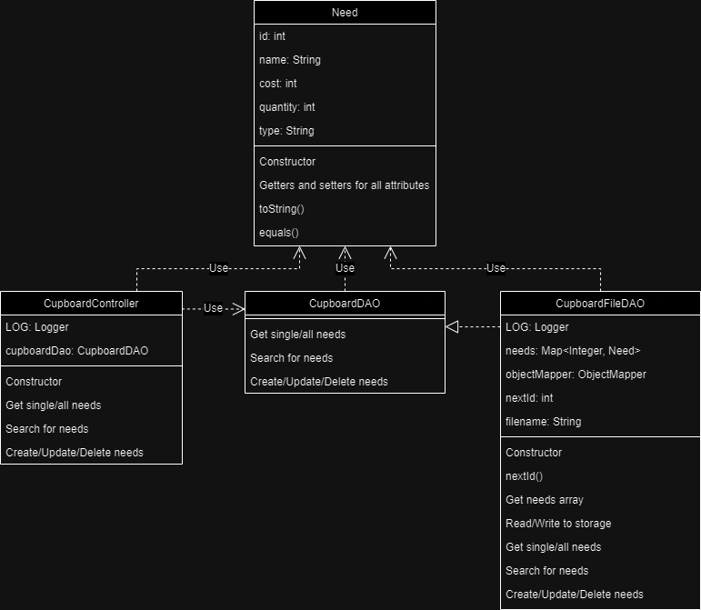
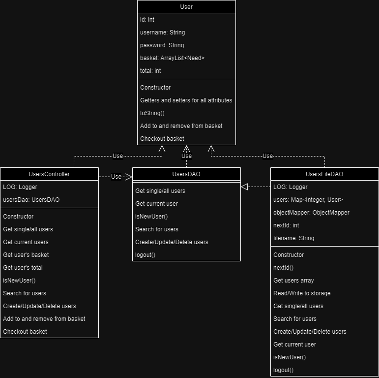
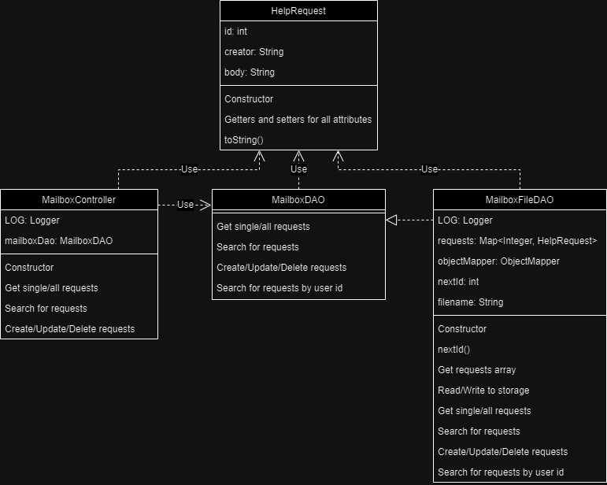

## OO Design Principles

    While getting started with this project and during the first sprint, we need to make sure that we are focusing on the idea of single responsibility in the hopes that it will disperse the 'weight' of the functionality across multiple classes and functions.

    Controller: We use 3 controllers that handle curl requests sent from the front end that pass to DAO's to handle the method calls. Our MailboxController handles these curl commands that the request.service.ts passes to it in order to access the data from the back end.

    Open/Closed principle: The way our code exists now, it is very easy to be able to add methods to controllers and add generate componenets without altering the code that is working perfectly fine at the moment. This allows for the possibility of extending on without breaking the current working code. 

    Throughout the project we had to keep in mind the idea of encapsulation as we have to combine many methods and data to 
    single classes in order to manipulate data and hide the internal state of the object from the outside. This helps in maintaining the integrity of data and prevents unintended interference

`
> _**[Sprint 2, 3 & 4]** Will eventually address upto **4 key OO Principles** in your final design. Follow guidance in augmenting those completed in previous Sprints as indicated to you by instructor. Be sure to include any diagrams (or clearly refer to ones elsewhere in your Tier sections above) to support your claims._

> _**[Sprint 3 & 4]** OO Design Principles should span across **all tiers.**_

## Static Code Analysis/Future Design Improvements
> _**[Sprint 4]** With the results from the Static Code Analysis exercise, 
> **Identify 3-4** areas within your code that have been flagged by the Static Code 
> Analysis Tool (SonarQube) and provide your analysis and recommendations.  
> Include any relevant screenshot(s) with each area._

> _**[Sprint 4]** Discuss **future** refactoring and other design improvements your team would explore if the team had additional time._

    We would be able to delete a lot of code that is not used anymore. A decent amount of code got left behind when trying to meet deadlines for some sprints, as we went down a teammate, and this could be pruned through to get out unneeded code. 

Areas Flagged by SonarQube
- Reliability
- Maintainability
- Coverage

For Reliability and Code Coverage, apart of the reason why Reliability was flagged was because of old implementations of methods in UsersFileDAO, that have not been removed / edited due to lack of time. Tests for these methods were also not implemented as they currently give a compile-time error.

For Maintainability, we are given an A rating, however various issues are marked under Intentionality and Maintainability, for example more efficient formatting methods through the use of constants that are used repeatedly throughout the files.

For future refactoring and design improvements, we would make use of the Static Code Analysis Tool to find the weak points / inefficient parts of the application and makes changes for optimization, like better formatting practices. With additional time, we would also be able to revise redundant/useless code that may have been missed during other times of refactoring during a Sprint.

## Testing
> _This section will provide information about the testing performed
> and the results of the testing._

### Acceptance Testing
> _**[Sprint 2 & 4]** Report on the number of user stories that have passed all their
> acceptance criteria tests, the number that have some acceptance
> criteria tests failing, and the number of user stories that
> have not had any testing yet. Highlight the issues found during
> acceptance testing and if there are any concerns._

Sprint 4 - 

16 Passed Tests
11 Failed Tests -> (Mostly features that had to be cut to meet the Sprint 3 Deadline)
0 User Stories Not

Initially there was an issue with persistency on the front-end where a User's basket would be cleared everytime they re-login, however this was resolved by the deadline of Sprint 3.

### Unit Testing and Code Coverage
> _**[Sprint 4]** Discuss your unit testing strategy. Report on the code coverage
> achieved from unit testing of the code base. Discuss the team's
> coverage targets, why you selected those values, and how well your
> code coverage met your targets._

>_**[Sprint 2 & 4]** **Include images of your code coverage report.** If there are any anomalies, discuss
> those._

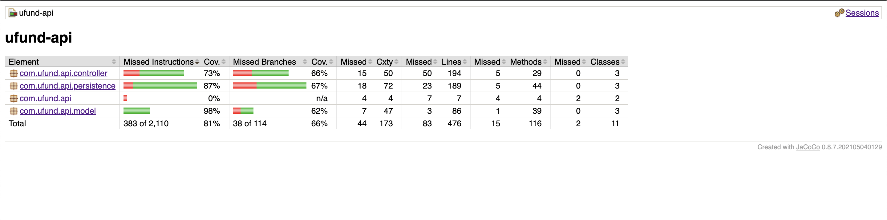
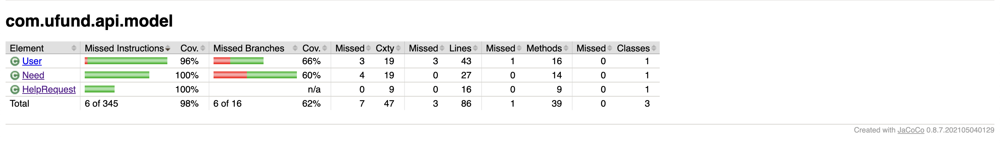
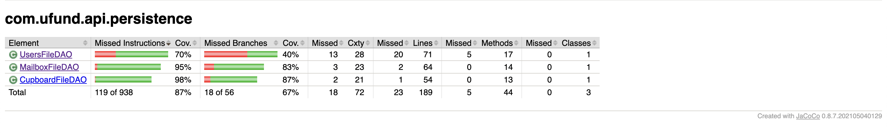
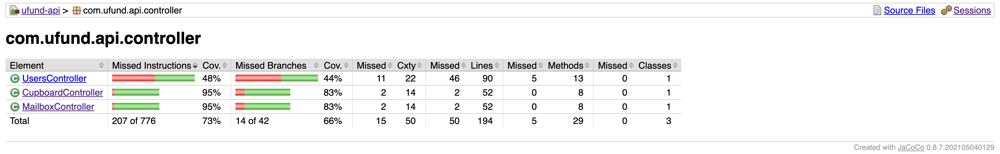

Our Unit testing strategy involved testing both successful cases and unsuccessful cases of each method, for example NullExceptions and IOExceptions. As shown above, each tier has generally pretty high code coverage, where Unit Tests of the UserController class is the only class with less than 50% coverage.

## Ongoing Rationale
>_**[Sprint 1, 2, 3 & 4]** Throughout the project, provide a time stamp **(yyyy/mm/dd): Sprint # and description** of any _**mayor**_ team decisions or design milestones/changes and corresponding justification._

Sprint 3 2024/04/01 - Simplify Request functionality, by not having requests go back and forth from User to Admins, but just have Requests go to Admins and Admins can just mark them as resolved.
Includes not having the ability to modify a request after it's sent, or a search area for requests, since only Admins are able to view requests once its sent. (Saves time of implementation by deadline of Sprint 3)

Sprint 3 2024/04/05 - In order to achieve the MVP, doing only one enhancement instead of two to save time (Requests Enhancement > Statistics Enhancement)
